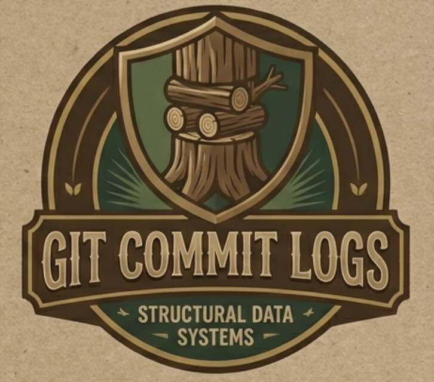

# RLM Git Commits
<p align="center">
  
</p>

A complete system for turning your git history into a queryable agent memory layer, built on the Recursive Language Model (RLM) pattern. No external infrastructure required. This repository provides two complementary skills (writing structured commits and querying them), plus a hook system that implements RLM over your commit history: the local LLM recursively queries a trailer index, persists findings in working memory, and surfaces context before every prompt.

## Table of Contents

- [Why This Exists](#why-this-exists)
- [What You Get](#what-you-get)
- [The RLM Pattern](#the-rlm-pattern)
- [Installation](#installation)
- [Quick Start](#quick-start)
- [Claude Code Hooks](#claude-code-hooks)
- [Retrofitting Existing Commits](#retrofitting-existing-commits)
- [Intent Taxonomy](#intent-taxonomy)
- [Benchmarking](#benchmarking)
- [Trailer Reference](#trailer-reference)
- [Performance](#performance)
- [Customization](#customization)
- [Design Philosophy](#design-philosophy)
- [Anti-Patterns to Avoid](#anti-patterns-to-avoid)
- [License](#license)
- [Contributing](#contributing)

## Why This Exists

Git commits are already versioned, always present, and co-located with your code. This system makes them serve double duty: human-readable change logs and machine-parseable memory that AI agents can query to reconstruct context, understand decisions, and avoid repeating work.

Every commit includes structured trailers from a controlled vocabulary, making your git log semantically searchable. When an agent asks "why did we choose this approach?" or "what alternatives were considered?", the answers live in your commit history.

## What You Get

Standard commits tell you *what* changed. Structured commits tell you *why* it changed, *what alternatives were rejected*, and *what intent motivated it*. This turns `git log` into a decision archaeology tool.

Compare a standard commit:

```
feat: add user authentication
```

To a structured commit:

```
feat(auth): add passkey registration for AI agent identities

Implement WebAuthn registration flow supporting non-human identity types.
Agent identities use deterministic key derivation instead of user gestures,
enabling automated credential provisioning during agent onboarding.

Intent: enable-capability
Scope: auth/registration, identity/agent
Decided-Against: OAuth2 client credentials (no hardware binding guarantee)
Session: 2025-02-08/passkey-lib
```

The second commit is machine-queryable. An agent can search for all `enable-capability` commits, filter by scope, or find every decision made about authentication alternatives.

## The RLM Pattern

The Recursive Language Model (RLM) paradigm (Zhang, Kraska, Khattab - [arXiv 2512.24601](https://arxiv.org/abs/2512.24601), Dec 2025) proposes that LLMs treat long context as an external environment rather than consuming it all at once. Instead of stuffing everything into the prompt, the LLM recursively calls itself to peek, grep, partition, and aggregate over the data - interacting with it the way a programmer uses a REPL.

This system implements RLM over git commit history. The trailer index is the pre-processed environment, the local LLM (Ollama) performs recursive sub-calls to analyze prompts, generate follow-up queries, and summarize results, and working memory provides persistent state across turns - functioning as REPL variables that carry forward between interactions.

### Paper Concept Mapping

| RLM Paper Concept | Our Implementation |
|---|---|
| Environment (external data) | Git commit history + trailer index (`.git/info/trailer-index.json`) |
| REPL variables (persistent state) | Working memory (`.git/info/working-memory.json`) |
| Peek / Grep operations | Standard: keyword matching; REPL: `query()` and `gitLog()` API in sandbox |
| Recursive sub-calls | Standard: hardcoded pipeline; REPL: `callLlm()` in LLM-generated code |
| Aggregation | Standard: `summarizeContext()`; REPL: LLM decides via `done(summary)` |
| Persistent state across sessions | Session summaries, consolidated at Stop hook (`.git/info/session-summary-{slug}.md`) |

### Where We Diverge

The implementation provides two modes with different trade-offs:

**Standard mode (llm-enhanced)**: Makes pragmatic simplifications for speed. Recursion is shallow (at most two follow-up queries per prompt). Operations are predefined (scope matching, intent filtering, decision archaeology) rather than arbitrary code. This mode prioritizes low latency (1-3s) for typical use cases.

**REPL mode (advanced)**: Implements the full RLM pattern where the local LLM writes JavaScript code executed in a sandboxed Deno Worker. The LLM decides what to inspect, when to recurse via callLlm(), and when to stop via done(). This mode is higher latency (3-8s) but allows dynamic exploration beyond the hardcoded pipeline.

Both modes use dual LLMs: a local Ollama model handles the recursive sub-calls and context extraction, while Claude handles the actual coding work. The lifecycle is hook-driven - Claude Code events (UserPromptSubmit, PostToolUse, Stop) trigger the environment interactions.

## Installation

### Automated (Recommended)

The fastest way to add the full system to an existing project:

```bash
# Install into your project
deno task rlm:install -- --target=/path/to/your/project

# Preview what will be changed
deno task rlm:install -- --target=/path/to/your/project --dry-run

# Remove from a project
deno task rlm:install -- --target=/path/to/your/project --uninstall
```

This copies 16 script files, merges 3 Claude Code hook definitions into `.claude/settings.json`, injects 5 instruction sections into `CLAUDE.md`, and adds 5 deno tasks to `deno.json`. The target must be a git repository with `deno` available on PATH.

The script is idempotent: running it again upgrades in place without duplicating entries. Use `--skip-hooks` if the target project manages `.claude/settings.json` separately.

After installing, start a Claude Code session in the target project. The hooks begin injecting context automatically using keyword-based matching.

**Optional: Enable Local LLM Enhancement**

For smarter prompt analysis and recursive context extraction, enable local LLM mode (requires Ollama):

```bash
# In the target project
ollama pull qwen2.5:7b
deno task rlm:configure -- --enable --check
```

See [Local LLM Mode](#local-llm-mode) for detailed setup instructions and troubleshooting.

### Manual

If you prefer granular control, install components individually.

**Claude Code skills** (teaches Claude the commit format and query patterns):

```bash
# Install both skills (recommended)
cp -r skills/* ~/.claude/skills/

# Or install individually
mkdir -p ~/.claude/skills
cp -r skills/git-structure-commits ~/.claude/skills/
cp -r skills/git-query-commits ~/.claude/skills/
```

**Git commit-msg hook** (validates commit messages on every commit):

```bash
# Local (current repo only)
deno task hook:install

# Global (all repos)
deno task hook:install --global

# Remove
deno task hook:install --uninstall
```

The hook rejects commits with errors (missing Intent, invalid format, etc.) while allowing warnings to pass.

**Commit template** (format guidance in your editor):

```bash
git config commit.template path/to/templates/.gitmessage
```

**Session auto-population** (avoids manually typing Session IDs):

```bash
export STRUCTURED_GIT_SESSION="2025-02-08/my-feature"
```

Add a prepare-commit-msg hook that auto-fills the trailer:

```bash
#!/bin/sh
if [ -n "$STRUCTURED_GIT_SESSION" ]; then
  if ! grep -q "^Session:" "$1"; then
    echo "" >> "$1"
    echo "Session: $STRUCTURED_GIT_SESSION" >> "$1"
  fi
fi
```

### Prerequisites

The validation and parsing scripts require [Deno](https://deno.land). The skills themselves (SKILL.md files and reference docs) work without Deno - they just guide how Claude writes and queries commit messages. Deno is only needed if you want the CLI tools: `deno task validate`, `deno task parse`, `deno task retrofit`, `deno task hook:install`, `deno task rlm:configure`, and the memory utilities (`deno task memory:write`, `memory:clear`, `memory:consolidate`).

## Quick Start

For a comprehensive walkthrough, see the [User Guide](GUIDE.md).

### The Two Skills

This system has two complementary skills:

1. **[git-structure-commits](skills/git-structure-commits/SKILL.md)** - Write commits that serve as agent memory with structured trailers, controlled vocabulary, and decision records
2. **[git-query-commits](skills/git-query-commits/SKILL.md)** - Query commit history to reconstruct context, understand past decisions, and avoid repeating work

Both skills work independently, but together they create a zero-infrastructure agent memory layer. The first skill ensures commits are machine-parseable, the second skill teaches agents when and how to query them.

### Writing Commits

When committing code, follow the format in [references/commit-format.md](skills/git-structure-commits/references/commit-format.md):

1. Write a conventional commits subject line: `type(scope): description`
2. Add a body explaining what and why
3. Include required trailers: `Intent:` and `Scope:`
4. Record alternatives you considered: `Decided-Against:`

The intent must be one of eight values from the [controlled vocabulary](skills/git-structure-commits/references/intent-taxonomy.md): `enable-capability`, `fix-defect`, `improve-quality`, `restructure`, `configure-infra`, `document`, `explore`, or `resolve-blocker`.

### Querying Commits

Quick reference for reconstructing context from commit history:

```bash
# Find all commits from a specific session
git log --format='%H %s' --grep='Session: 2025-02-08'

# Find decisions about a specific module
git log --format='%B' --grep='Decided-Against' -- path/to/module

# Filter by intent
git log --format='%H %s' --grep='Intent: enable-capability' --since='1 week ago'

# Parse structured trailers
git log -1 --format='%(trailers:key=Intent,valueonly)' <commit-hash>
```

A Deno utility for richer parsing is available at [scripts/parse-commits.ts](scripts/parse-commits.ts). Run it with `deno task parse` (see [deno.json](deno.json) for all tasks).

For detailed guidance on querying commit history, see [skills/git-query-commits/SKILL.md](skills/git-query-commits/SKILL.md).

## Claude Code Hooks

Three hooks implement the RLM pattern described above, giving Claude automatic access to git history context without active querying. These are installed automatically by `deno task rlm:install`, or can be configured manually.

**UserPromptSubmit** - injects git history context before every prompt. Operates in three modes:
- *llm-enhanced*: uses a local LLM (Ollama) for smart prompt analysis, recursive follow-up queries, and context summarization
- *prompt-aware*: keyword-based extraction of scopes and intents from the prompt, matched against the trailer index
- *recency*: falls back to the N most recent commits when no signals match

Also injects working memory (session-scoped findings, decisions, and hypotheses persisted across prompts).

**PostToolUse** - bridge hook that fires after `deno task parse` queries. Surfaces related decided-against entries and sibling scopes the query did not directly ask for. When LLM mode is enabled, the heuristic output is summarized by the local model.

**Stop** - consolidates working memory into a session summary when a session ends. Writes to `.git/info/session-summary-{slug}.md`.

### Manual Hook Configuration

The hook configuration lives in `.claude/settings.json` (already included in this repository):

```json
{
  "hooks": {
    "UserPromptSubmit": [
      {
        "hooks": [
          {
            "type": "command",
            "command": "deno run --allow-run --allow-read --allow-env --allow-net scripts/git-memory-context.ts"
          }
        ]
      }
    ],
    "PostToolUse": [
      {
        "matcher": "Bash",
        "hooks": [
          {
            "type": "command",
            "command": "deno run --allow-run --allow-read --allow-env --allow-net scripts/git-memory-bridge.ts",
            "async": true
          }
        ]
      }
    ],
    "Stop": [
      {
        "hooks": [
          {
            "type": "command",
            "command": "deno run --allow-run --allow-read --allow-write --allow-env scripts/git-memory-consolidate.ts"
          }
        ]
      }
    ]
  }
}
```

Add the instructions from `CLAUDE.md` (git-memory, working-memory, git-memory-bridge, memory-consolidation, rlm-local-llm sections) to your project's CLAUDE.md so Claude knows how to use the injected context.

Verify the hooks work by running:

```bash
deno task context
```

This should produce a `<git-memory-context>` block with recent commits and decisions. In a live Claude Code session, this output is automatically injected before Claude processes each prompt.

### Local LLM Mode

The system can use a local LLM (Ollama) to enhance git memory context extraction. When enabled, the hooks perform smart prompt analysis, generate recursive follow-up queries, and summarize bridge context using a locally-run model instead of keyword matching.

#### Prerequisites

1. Install Ollama from [ollama.com](https://ollama.com) if not already installed
2. Start the Ollama service (it runs on `localhost:11434` by default)
3. Pull the default model (qwen2.5:7b):

```bash
ollama pull qwen2.5:7b
```

The default model is qwen2.5:7b because it provides a good balance of speed and quality for git context analysis. The system also has first-class support for qwen3 models, which automatically receive higher token limits (1024 vs 256) and longer timeouts (20s vs 5s) to accommodate their extended reasoning chains. You can use any Ollama model (llama3.2:3b for faster but less accurate results, or larger models if you have the resources).

#### Setup

Enable local LLM mode and verify connectivity:

```bash
deno task rlm:configure -- --enable --check
```

This will:
- Enable LLM-enhanced mode in `.git/info/rlm-config.json`
- Test connectivity to Ollama
- Confirm the model responds correctly

You should see output like:

```
Current RLM config:
  enabled:   true
  endpoint:  http://localhost:11434
  model:     qwen2.5:7b
  timeoutMs: 5000
  maxTokens: 256

Checking http://localhost:11434 with model qwen2.5:7b...
Connected. Response: "ok"
```

#### Verify It's Working

In your next Claude Code session, the UserPromptSubmit hook will indicate which mode is active. Look for the mode attribute in the git context:

```xml
<git-memory-context mode="llm-enhanced">
```

If Ollama is unreachable, the system falls back silently to prompt-aware or recency mode.

#### Configuration Options

View current config:

```bash
deno task rlm:configure
```

Change the model (useful for speed/quality trade-offs):

```bash
# Faster but less accurate
deno task rlm:configure -- --model=llama3.2:3b

# Larger model for better analysis
deno task rlm:configure -- --model=qwen2.5:14b

# qwen3 models (automatically get 20s timeout and 1024 token limit)
deno task rlm:configure -- --model=qwen3:8b
```

Adjust timeout (if your model is slow to respond):

```bash
deno task rlm:configure -- --timeout=10000  # 10 seconds
```

Change endpoint (if Ollama runs on a different host):

```bash
deno task rlm:configure -- --endpoint=http://192.168.1.100:11434
```

Disable LLM mode:

```bash
deno task rlm:configure -- --disable
```

#### Troubleshooting

**"Failed: Connection refused"**

Ollama is not running. Start it with:

```bash
ollama serve
```

**"Failed: model 'qwen2.5:7b' not found"**

Pull the model:

```bash
ollama pull qwen2.5:7b
```

**Hook timeout or very slow responses**

The default timeout is 5000ms (5 seconds). If your machine is slow or the model is large, increase the timeout:

```bash
deno task rlm:configure -- --timeout=10000
```

Or switch to a smaller, faster model:

```bash
ollama pull llama3.2:3b
deno task rlm:configure -- --model=llama3.2:3b
```

**Not sure if LLM mode is active**

Check the mode in the git context injected before prompts. The XML tag will show `mode="llm-enhanced"` when active, `mode="prompt-aware"` for keyword matching, or `mode="recency"` for the basic fallback.

You can also manually run the context script:

```bash
deno task context
```

And check the output for the mode attribute.

#### JSON Parsing and Model Compatibility

The system includes robust JSON parsing that handles common LLM output variations:
- Markdown fenced code blocks (```json...```)
- JSON objects wrapped in surrounding text or commentary
- Array-based content responses from certain models
- Trailing /think suffixes

This ensures hook reliability even when models return malformed or decorated JSON. The parsing layer automatically normalizes and extracts valid JSON from noisy responses, preventing hook failures that would otherwise block your workflow.

#### Performance Impact

LLM-enhanced mode adds 1-3 seconds of latency to prompt processing (depending on model size and hardware). The local model handles:
- Analyzing your prompt to extract relevant scopes and intent
- Generating 0-2 follow-up queries based on prompt content
- Summarizing bridge context after tool use

This happens before Claude sees your prompt, so you'll notice a slight delay before Claude starts responding. The delay is consistent and bounded by the configured timeout.

If the added latency is unacceptable, you can disable LLM mode and fall back to prompt-aware (keyword-based) or recency mode, which have negligible overhead.

#### Config Storage

Configuration is stored at `.git/info/rlm-config.json` (local, not committed). Each repository can have independent settings. The default config when no file exists:

```json
{
  "version": 1,
  "enabled": false,
  "endpoint": "http://localhost:11434",
  "model": "qwen2.5:7b",
  "timeoutMs": 5000,
  "maxTokens": 256,
  "replEnabled": false,
  "replMaxIterations": 6,
  "replMaxLlmCalls": 10,
  "replTimeoutBudgetMs": 15000,
  "replMaxOutputTokens": 512
}
```

### REPL Mode (Advanced)

The system supports an advanced REPL (Read-Eval-Print Loop) mode that implements the full RLM pattern from the Zhang et al. paper. Instead of hardcoded sub-calls (analyze, follow-up, summarize), the local LLM writes JavaScript code that executes in a sandboxed Deno Worker against the pre-loaded git history index.

#### How It Works

In REPL mode, the LLM receives a system prompt describing the sandbox API and writes code to explore the git history. The LLM decides what to inspect, when to recurse via `callLlm()`, and when to stop via `done()`. The sandbox provides:

- **query(scope, intent, decidedAgainst, limit)** - Query the trailer index
- **gitLog(args)** - Execute git log commands with sanitized arguments
- **callLlm(prompt, maxTokens)** - Recursive LLM calls for deeper analysis
- **done(summary)** - Return results and exit the REPL loop
- **workingMemory** - Access to session findings and decisions

#### Safety Model

Three layers of safety prevent runaway execution:
1. **Per-LLM-call timeout** - Individual LLM requests timeout after configured duration
2. **Per-execution timeout** - Each sandbox code execution has a bounded runtime
3. **Total wall-clock budget** - The entire REPL session has a maximum duration (default 15s)

The sandbox runs with zero OS permissions (no file system, no network, no environment access).

#### Enabling REPL Mode

REPL mode requires local LLM mode to be enabled first:

```bash
# Enable LLM mode
deno task rlm:configure -- --enable --check

# Enable REPL mode
deno task rlm:configure -- --repl-enable
```

Configuration options:

```bash
# Disable REPL mode
deno task rlm:configure -- --repl-disable

# Adjust iteration and call limits
deno task rlm:configure -- --repl-max-iterations=3
deno task rlm:configure -- --repl-max-llm-calls=5

# Adjust timeout budget (milliseconds)
deno task rlm:configure -- --repl-timeout-budget=8000

# Adjust output token limit
deno task rlm:configure -- --repl-max-output-tokens=256
```

#### When to Use REPL Mode

REPL mode is more flexible than the sub-call approach but adds complexity and latency. Use it when:
- You need dynamic exploration beyond the hardcoded 4-step pipeline
- Your prompts require complex multi-step reasoning over git history
- The LLM benefits from deciding its own query strategy

For most use cases, the default sub-call mode (llm-enhanced without REPL) provides sufficient context extraction with lower latency.

#### Performance Characteristics

REPL mode typically adds 3-8 seconds of latency depending on:
- LLM generation speed for code
- Number of iterations and recursive calls
- Complexity of git history queries

The system falls back gracefully to the standard sub-call pipeline if REPL execution fails or times out.

### Working Memory

Persist findings and decisions within a session:

```bash
# Persist a finding or decision
deno task memory:write -- --tag=finding --scope=auth --text="JWT uses sliding window"

# Clear working memory
deno task memory:clear

# Generate commit trailer hints from session decisions
deno task memory:consolidate -- --commit-hints
```

## Retrofitting Existing Commits

If you have an existing repository with unstructured commits, the retrofit utility generates structured commit messages using Claude:

```bash
# Preview what will be processed (no API calls)
deno task retrofit -- --dry-run --limit=10

# Generate structured messages for the last 20 commits
deno task retrofit -- --limit=20 --output=retrofit-report.md

# Resume a previous run (skips cached commits)
deno task retrofit -- --resume --output=retrofit-report.md

# Rewrite git history with validated messages (destructive - creates backup refs)
deno task retrofit -- --apply
```

The utility extracts each commit's message, diff stats, and shortstat, sends them to Claude with the format spec and intent taxonomy as system context, validates the generated messages against the same rules as the commit-msg hook, and retries on validation errors. Results are cached to `.retrofit-cache.json` for resume support.

The `--apply` flag rewrites history using `git filter-branch`. Only commits with zero validation errors are rewritten. Original refs are saved to `refs/original/` for recovery. Requires `ANTHROPIC_API_KEY` environment variable.

## Intent Taxonomy

Every commit must include exactly one intent from this vocabulary:

| Intent | Use When |
|--------|----------|
| `enable-capability` | Adding new user-facing or system capability |
| `fix-defect` | Correcting incorrect behavior |
| `improve-quality` | Non-functional improvement (performance, readability, resilience) |
| `restructure` | Architectural change, module extraction, code movement |
| `configure-infra` | Tooling, CI/CD, dependencies, build system |
| `document` | Documentation, ADRs, comments, API docs |
| `explore` | Spike, prototype, hypothesis validation |
| `resolve-blocker` | Unblocking a dependent task or workflow |

See [references/intent-taxonomy.md](skills/git-structure-commits/references/intent-taxonomy.md) for detailed definitions and usage guidance.

## Benchmarking

To empirically compare `llm-enhanced` vs `prompt-aware` vs `recency` modes, use the benchmark scripts in `bench/` and `scripts/benchmark-*.ts`.

Quick start:

```bash
deno task bench:context -- --dataset=bench/prompts.real.jsonl --out-dir=bench/results/run-001 --runs=3 --models=gemma2:3b,qwen2.5:7b
deno task bench:score:retrieval -- --dataset=bench/prompts.real.jsonl --runs=bench/results/run-001/runs.jsonl --trace=bench/results/run-001/trace.jsonl --out=bench/results/run-001/retrieval-report.json
```

For full methodology (dataset labeling, response-quality scoring, latency analysis, model sweeps, and variable controls), see [bench/README.md](bench/README.md).

## Trailer Reference

Required trailers:
- **Intent**: One value from the taxonomy above
- **Scope**: Comma-separated domain paths (e.g., `auth/registration, api/middleware`)

Optional but highly valuable:
- **Decided-Against**: Alternatives you considered and rejected, with reasons
- **Session**: ISO date + slug to group related commits (e.g., `2025-02-08/passkey-lib`)
- **Refs**: Related commits, issues, or docs (e.g., `abc123f, #1847`)
- **Context**: Compact single-line JSON for structured metadata

### The `Decided-Against` Trailer

This is the highest-value trailer for agent memory. When you evaluate alternatives and pick one, record what you rejected and why:

```
Decided-Against: OAuth2 client credentials (no hardware binding guarantee)
Decided-Against: longer timeout window (masks upstream latency issues)
```

Without this, the next agent working in the same area will waste time re-evaluating the same options. With it, they can query your reasoning and build on your decisions instead of repeating them.

## Performance

Two optional optimizations accelerate queries as repositories grow:

- **Commit-graph** (`deno task graph:write`): Writes a binary acceleration structure with changed-paths Bloom filters, speeding up path-based queries (`--path=`) by 2-30x and enabling fast ancestry checks via `--since-commit=HASH`. Does not speed up `--grep` searches.
- **Trailer index** (`deno task index:build`): Builds an inverted index of trailer values to commit hashes at `.git/info/trailer-index.json`, making intent/scope/session/decided-against lookups O(1) instead of O(n) grep scans.

Run both at once with `deno task optimize`. See [references/performance.md](skills/git-query-commits/references/performance.md) for details.

## Customization

The format, taxonomy, and tooling are designed to be forked and adapted. The
intent vocabulary, known trailer keys, and validation rules are all defined in
plain TypeScript with no external dependencies. If your project needs different
intents, additional trailers, or looser validation, edit `scripts/types.ts` and
`scripts/lib/validator.ts` directly. The taxonomy is intentionally small so
that changes are easy to reason about.

## Examples

See [skills/git-structure-commits/SKILL.md](skills/git-structure-commits/SKILL.md) for complete examples covering:
- Simple feature additions
- Bug fixes with decision context
- Architectural refactors
- Exploratory spikes
- Infrastructure configuration

## Design Philosophy

This system follows three principles:

1. **Git commits are the source of truth**: No external databases, no separate documentation systems. The commit history is authoritative.

2. **Human-readable, machine-parseable**: Commits remain scannable by developers while being queryable by agents. The format adds structure without sacrificing readability.

3. **Controlled vocabulary prevents drift**: The intent taxonomy is fixed and small. This makes semantic queries reliable and prevents the "tagging chaos" that emerges from freeform metadata.

## Anti-Patterns to Avoid

- Using file paths as scopes instead of domain concepts
- Including multiple intents in one commit (split the commit instead)
- Empty commit bodies (the subject line is never enough)
- Generic scopes like "backend" (be specific: `auth/session, api/middleware`)
- Omitting `Decided-Against` when you evaluated alternatives

## License

MIT

## Contributing

This format is intentionally minimal and stable. Proposals to add new intent types or trailer fields should demonstrate that:

1. The information cannot be expressed with existing trailers
2. The addition would be valuable across projects and domains
3. The vocabulary remains small enough for agents to reliably query

Open an issue to discuss before submitting PRs that change the taxonomy.
